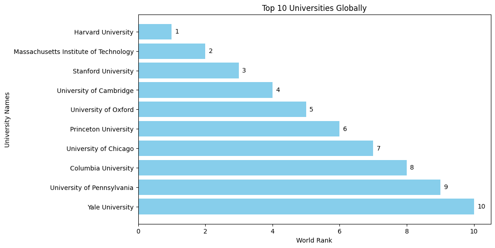
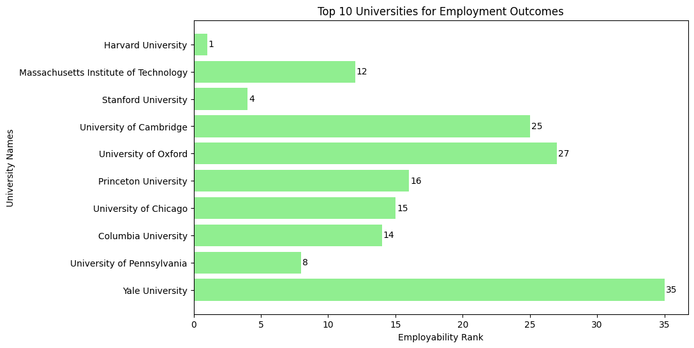
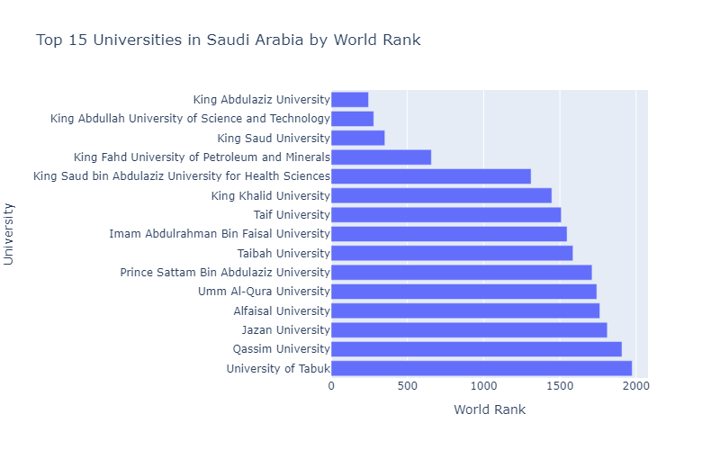
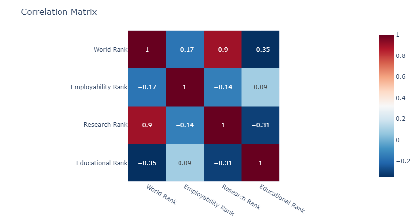

# Use-case-3-Project-2

## Questions

### 1. Which universities are ranked in the top 10 globally?

**ANSWER:** The top 10 universities globally are highly respected for their academic excellence. Harvard University, in particular, holds the top spot and is renowned for its exceptional education and research. These universities have made significant contributions to academia and play a crucial role in shaping the future of education.

### 2. Which universities are ranked in the top 10 for employment outcomes?

**ANSWER:** The top 10 universities for employment outcomes are known for preparing graduates for successful careers. Harvard University ranks at the top, with graduates highly sought after by employers worldwide. These universities focus on equipping students with the skills needed to excel in their fields. With strong industry connections and practical experience, graduates from these universities have a competitive advantage in the job market. Students looking for promising employment opportunities often choose these universities for their commitment to career success. 3. What positions do universities in Saudi Arabia hold within the global rankings?

### 3. What positions do universities in Saudi Arabia hold within the global rankings?

**ANSWER:** Saudi Arabia's top 15 universities have achieved notable positions in global rankings. King Abdulaziz University leads the pack at 244th place, followed by King Abdullah University of Science and Technology at 278th place, and King Saud University at 351st place. These universities are recognized for their commitment to excellence in education and research, making significant contributions to Saudi Arabia's academic landscape.

### 4. Is there a **correlation** between **national and global** university rankings, and

**based on this information**, can you **recommend a country** that appears to
have a **high concentration of top-ranked universities**?

**ANSWER:** Research Rank is the most factor that impact the global ranks

### 5. Is there a **correlation** between **national and global** university rankings, and

**based on this information**, can you **recommend a country** that appears to
have a **high concentration of top-ranked universities**?

**ANSWER:** Research Rank is the most factor that impact the global ranks

## Datasets

- Times Higher Education World University Ranking (THE):
  - The Times Higher Education Impact Rankings are the only global performance tables that assess universities against the United Nations’ Sustainable Development Goals (SDGs).
- Academic Ranking of World Universities (ARWU):
  - emphasizes research power and raw metrics like publications and Nobel laureates. Critics argue that it undervalues humanities and instructional quality.
- Center for World University Rankings (CWUR):
  - CWUR uses various indicators like research output and quality of faculty to rank universities. (ranking from Saudi Arabia)

## Datasets issues

Are we using all datasets? **yes**

### Center World University Ranking

- fake nulls (for what it looks like unis without rank)
- Wrong data types
- To much outliers because the neccesary dublicats values and the empty nulls
- To much natural outliers

### Times Higher Education World University Ranking

- Location 6% missing (we may need to fill it from google)
- missing links (no action needed)
- what is SDG :
- | Number | Meaning                                  |
  | ------ | ---------------------------------------- |
  | 1      | No Poverty                               |
  | 2      | Zero Hunger                              |
  | 3      | Good Health and Well-being               |
  | 4      | Quality Education                        |
  | 5      | Gender Equality                          |
  | 6      | Clean Water and Sanitation               |
  | 7      | Affordable and Clean Energy              |
  | 8      | Decent Work and Economic Growth          |
  | 9      | Industry, Innovation, and Infrastructure |
  | 10     | Reduced Inequalities                     |
  | 11     | Sustainable Cities and Communities       |
  | 12     | Responsible Consumption and Production   |
  | 13     | Climate Action                           |
  | 14     | Life Below Water                         |
  | 15     | Life On Land                             |
  | 16     | Peace, Justice, and Strong Institutions  |
  | 17     | Partnerships for the Goals               |

- data date to 2023 (after researching and matching the results i found that the dataset belong to [Impact Rankings 2023](https://www.timeshighereducation.com/impactrankings))

### Shanghai Ranking

- Identical Scores: In the global ranking, there may be duplicates with identical scores.
- Range Ranks: Universities are ranked within ranges rather than precise positions.
- Alphabetical Order: If universities share the same rank, they are ordered alphabetically.
- Outliers: Top university scores are considered outliers as many scores are concentrated below the top 25.
- uplicates: Duplicates may occur within national rankings as well.
- The provided data reflects the year 2022 and has undergone extensive research and matching to ensure accuracy. However, users should exercise caution in drawing conclusions due to potential inaccuracies stemming from duplicate entries and lack of timeliness.  
  [Shanghairanking 2022](https://www.shanghairanking.com/rankings/arwu/2022)
